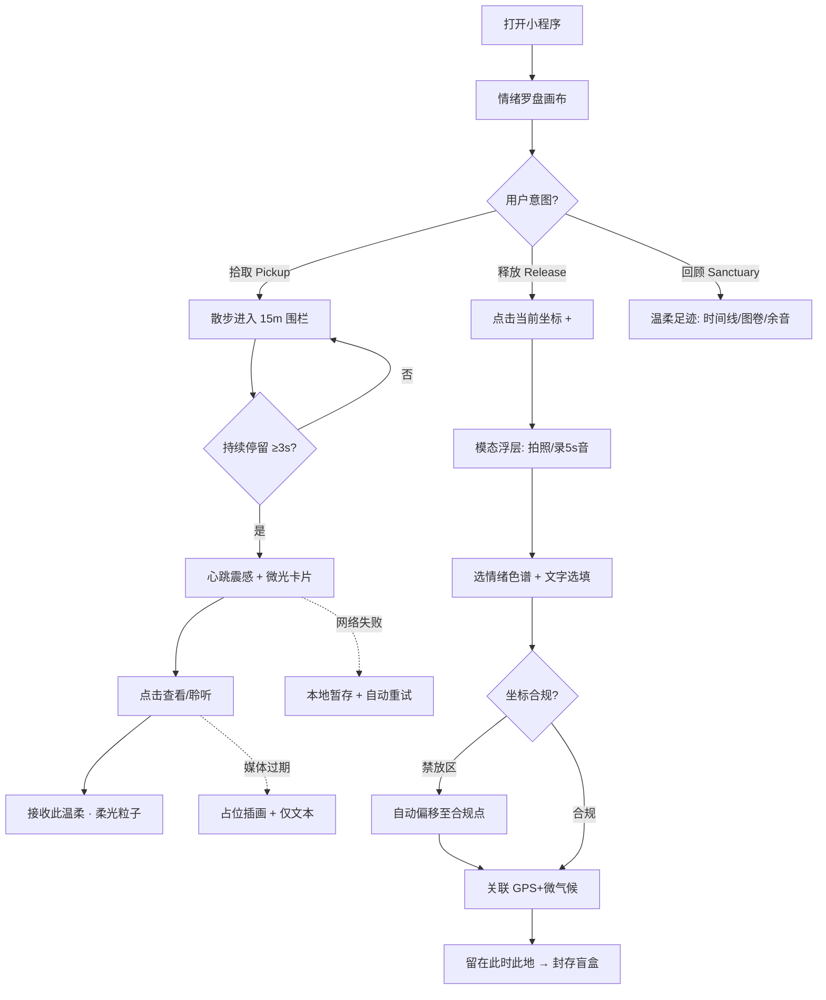

# 《街角情绪盲盒》产品需求文档（PRD）

> **产品代号**：街角情绪盲盒（Street-Corner Emotion Blind Box）· 15-Min Emotion Map
> **形态**：微信小程序（LBS 轻量化情绪地理应用）
> **文档版本**：v2.0（prd-writer 结构化落地版，可直接用于评审与开发对齐）
> **编写日期**：2026-07-21
> **作者**：产品通（基于设计概念稿扩展）
> **状态**：评审稿

---

## 文档信息

| 项 | 内容 |
|----|------|
| 产品形态 | 微信小程序（非 App、非独立 H5） |
| 一期范围 | MVP：拾取 / 释放 / 足迹三大主链路 |
| 优先级图例 | 🔴 核心（MVP 必须）· 🟡 重要（迭代）· ⚪ 未来规划 |
| 关联输入 | 设计概念稿《街角情绪盲盒 PRD（15-Min Emotion Map）》 |

> 原文（设计概念稿）未定义的具体数值（并发、响应时间、留存目标等）均以「建议基线 · 待评审确认」标注，避免数据独裁，需在技术方案评审与压测中由研发与数据共同确认。

---

## 一、产品概述与目标

### 1.1 一句话定位
> 这是一个给**城市散步者**用的**微信小程序**，帮他们把 15 分钟步行圈变成有温度的情绪空间，**顺路收发微小而确定的温柔**。
> 与导航地图相比，核心差异是**去商业化、非入侵、异步无压连接**。

### 1.2 产品形态与选型理由
- **当前选型**：微信小程序。
- **选择理由**：目标用户集中在中国城市、使用频次中低（散步偶发）、强依赖 LBS 与分享传播；小程序无需下载、分享成本极低、可调用 GPS / 相机 / 麦克风 / 震动等能力，且适合"轻量、反刻意"的产品气质。
- **阶段策略**：一期仅小程序；若验证留存与内容生态健康，后续可考虑独立 App 或城市公共屏联动（不在本期范围）。

### 1.3 核心价值主张（设计原则）
| 原则 | 说明 | 对产品的硬约束 |
|------|------|----------------|
| 非入侵性 Non-intrusive | 零打卡压力、无排行榜、无点赞计数 | 不出现步数榜 / 打卡天数 / 点赞数 |
| 物理共鸣 Physical Resonance | 依赖实际步行到达坐标 | 盲盒须物理进入 15m 围栏方可解锁，不支持远程开启 |
| 异步无压连接 Asynchronous | 擦肩而过的微弱连接 | 仅单向"接收此温柔"，无评论 / 私信 / 好友链 |

### 1.4 业务目标与北极星指标
| 目标 | 衡量口径 | 建议基线 → 目标（待评审） |
|------|----------|----------------------------|
| 用户价值 | 周活中"无目的开启罗盘"占比 | 基线待埋点 → ≥ 40% |
| 社区健康 | 违规内容曝光占比 | ≤ 0.1% |
| 留存 | 无压力留存率（连续 2 周复访） | 基线待埋点 → ≥ 25% |
| 成本 | 单用户平均在架盲盒数 | ≤ 3（验证 72h 消散有效） |

**北极星指标**：① 近场共鸣解锁率（进入 15m 围栏后查看盲盒比例）；② 无压力留存率（连续 2 周在 15min 半径内开启罗盘散步的复访率）。

### 1.5 产品边界（Non-Goals）
- 不做社交关系链（无好友 / 私信 / 关注）。
- 不做商业引流与变现（无优惠券、无转化引导）。
- 不做高效路线导航（无最短路径、无赶路提示）。

---

## 二、目标用户群体定义

### 2.1 用户画像
**画像 A｜都市通勤疗愈者（核心用户）**
- 25–38 岁上班族，一二线城市，通勤 30–60 分钟。
- 痛点：工作压力大，难以专门安排疗愈；时间被切割。
- 诉求：通勤 / 午休 / 下班路上"顺手"获得微小确定的温柔。
- 设备：中高端 iOS / Android，日常携带、开启微信。

**画像 B｜社区慢行漫步者**
- 银发群体 / 自由职业者 / 宝妈，日常在社区周边活动。
- 痛点：孤独感、缺乏轻松的社区连接。
- 诉求：散步时偶遇他人留下的善意，获得心理安全感。
- 设备：中端 Android 为主，对操作简洁度敏感。

**画像 C｜夜间散步记录者**
- 22:00 后仍有散步习惯的年轻用户。
- 痛点：夜晚城市缺乏温度，渴望安静的情绪出口。
- 诉求：把晚霞、路灯、猫等瞬间封存留给陌生人。
- 设备：iOS 为主，对画质 / 动效质感要求较高。

### 2.2 典型使用场景
| 场景 | 模式 | 谁 · 何时 · 做什么 · 期望结果 |
|------|------|-------------------------------|
| 顺路拾取 | 拾取 | 下班族散步路过街角 → 手机轻震 → 滑出陌生人晚霞照与"今天也辛苦了" → 获得情绪抚慰 |
| 转角释放 | 释放 | 看到流浪猫与晚霞 → 拍照 + 选"暖意·橙" + 留一句 → 封存为街角盲盒留给下一个人 |
| 周末回顾 | 回顾 | 周日晚 → 收到 AIGC 水彩情绪图卷 → 无压力回顾本周心情 |

### 2.3 用户故事（标准格式）
- 作为**都市通勤者**，我希望在散步时被附近陌生人的温柔盲盒轻震提醒，以便在不刻意规划时获得情绪疗愈。
- 作为**社区漫步者**，我希望把路边的美好一键封存留给下一个人，以便传递善意而不必复杂编辑。
- 作为**夜间散步者**，我希望每周收到一幅属于自己的水彩情绪图卷，以便无压力地回顾一周心情。
- 作为**注重隐私的用户**，我希望我的实时位置不被任何人看到，以便安心使用而不担心被追踪。

---

## 三、功能需求列表（含优先级）

### 3.1 功能树（优先级总览）
```
街角情绪盲盒
├── 🔴 M1 情绪罗盘（主界面 / 默认 Landing）
│   ├── F-M1-01 去商业化画布渲染
│   ├── F-M1-02 视角模式切换（15min / 50m）
│   └── F-M1-03 呼吸感情绪光点（Capsule Marker）
├── 🔴 M2 近场感应与盲盒解锁（Proximity Unlock）
│   ├── F-M2-01 地理围栏触发（15m）
│   ├── F-M2-02 触觉反馈（心跳震感）
│   ├── F-M2-03 微光卡片浮现
│   └── F-M2-04 卡片内容与"接收此温柔"
├── 🔴 M3 情绪打包 / 发布（Capsule Drop）
│   ├── F-M3-01 发布入口与模态浮层
│   ├── F-M3-02 极简媒体捕捉（图 / 5s 音）
│   ├── F-M3-03 情绪色谱选择（必选）
│   ├── F-M3-04 文字随笔（选填 ≤140）
│   ├── F-M3-05 自动关联与提交封存
│   ├── F-M3-06 自然消散（72h 生命周期）
│   └── F-M3-07 匿名与安全感（温柔代号）
├── 🔴 M6 隐私保护与内容风控
│   ├── F-M6-01 位置异步保护（零实时轨迹）
│   └── F-M6-02 文本 + 视觉风控
├── 🔴 M7 地理安全偏移（Spatial Offset）
│   └── F-M7-01 坐标合规偏移
├── 🔴 M8 混合定位与功耗控制
│   └── F-M8-01 混合定位机制（前台步行高精度）
├── 🟡 M4 温柔足迹（Personal Sanctuary）
│   ├── F-M4-01 情绪时间线
│   └── F-M4-02 AIGC 水彩生成图卷
├── 🟡 M5 设计系统落地
│   ├── F-M5-01 情绪色谱（四色）
│   └── F-M5-02 动效与声效规范
└── ⚪ 未来规划（暂不在本期）
    ├── 多城市扩展与方言微气候
    ├── 无障碍增强（语音盲盒）
    └── 主题皮肤（季节限定）
```

### 3.2 🔴 核心功能详细描述

#### F-M1-01 去商业化画布渲染
- **功能描述**：首页默认渲染以用户 GPS 为中心、约 1km（15 分钟步行）半径水波纹画布；隐藏路名 / 商铺 / 车流，呈低饱和暗色柔光。
- **用户故事**：作为散步者，我希望打开就是一片安静的"情绪地图"，以便不被导航的效率感催促。
- **触发条件**：小程序启动并获定位权限。
- **交互细节 / 状态清单**：

| 状态 | 触发 | UI 表现 | 用户操作 |
|------|------|---------|----------|
| 默认 | 加载完成 | 水波纹圈 + 光点 | 浏览 / 点击 |
| 加载中 | 启动拉取底图 | 纯色柔光背景占位 | 不可重复触发 |
| 降级（无权限） | 定位失败 | 城市级默认画布 + 引导开启定位 | 去设置授权 |
| 弱网 | 底图超时 | 柔光背景 + 缓存光点 | 重试 |

- **边界条件**：
  - 内容为空（附近无盲盒）→ 空画布 + 引导文案"附近还很安静"。
  - 坐标抖动 → 中心 300ms 缓动，避免画面抖动。
  - 同屏光点 > 50 → 按近端优先渲染，超出淡出。
- **验收标准**：首屏 ≤ 1.5s；画布不含任何商业 POI 图层；非活动光点透明度 40%±5%。

#### F-M1-02 视角模式切换
- **功能描述**：点击水波纹区域，在"全局 15min 圈 / 近场 50m 圈"间切换。
- **用户故事**：作为用户，我希望放大看脚下 50 米的温柔，以便更聚焦。
- **触发条件**：点击水波纹区域。
- **边界条件**：50m 圈仅显示极近场光点，超出淡出；快速连点防抖。
- **验收标准**：切换动画 250ms；单次切换中忽略后续点击。

#### F-M1-03 呼吸感情绪光点
- **功能描述**：坐标处以"呼吸光点"呈现盲盒，颜色对应情绪；1.5s 周期呼吸缩放；近端透明度渐变至 100%。
- **用户故事**：作为用户，我希望光点随我靠近而变亮，以便感知"附近有温柔"。
- **触发条件**：画布渲染后持续监听用户位置。
- **边界条件**：透明度变化做 300ms 缓动插值，避免闪烁；光点数据为空则仅展示空画布。
- **验收标准**：呼吸周期 1.5s±0.1s；近端 100%、远端 40%±5%。

#### F-M2-01 地理围栏触发
- **功能描述**：用户物理进入某盲盒 15m 半径时触发解锁流程。
- **用户故事**：作为散步者，我希望走到附近时自然被提醒，以便顺路拾取。
- **触发条件**：实时定位落在 15m 围栏内且持续 3s。
- **边界条件**：仅前台 + 步行移动时启用高精度围栏；同一盲盒 24h 内对同一用户仅触发一次。
- **异常处理**：GPS 漂移误入 → 3s 持续停留确认；已在围栏内打开 → 进入即触发不重复震。
- **验收标准**：进入围栏至卡片弹出 ≤ 1s；同盲盒 24h 不重复触发。

#### F-M2-02 触觉反馈（心跳震感）
- **功能描述**：触发后调用线性马达，短震 2 次、间隔 300ms，模拟心跳。
- **用户故事**：作为用户，我希望用震动"被轻轻拍一下肩膀"，以便不打扰也能感知。
- **触发条件**：围栏触发确认。
- **边界条件**：iOS `Taptic Engine` / Android `Vibrator`；不支持震动则静默跳过；系统禁震则仅视觉。
- **验收标准**：震感序列误差 ≤ 50ms。

#### F-M2-03 微光卡片浮现
- **功能描述**：屏幕底部 Ease-out 上滑弹出【微光卡片】（250ms）。
- **用户故事**：作为用户，我希望卡片温柔地滑出来，而不是突兀弹窗。
- **触发条件**：围栏触发确认。
- **边界条件**：多盲盒同时触发 → 排队，一次一张；内容加载中先骨架屏。
- **验收标准**：动效 250ms，缓动 `cubic-bezier(0.25,1,0.5,1)`。

#### F-M2-04 卡片内容与"接收此温柔"
- **功能描述**：媒体区（图带模糊滤镜 / 5s 环境音自动播放可静音）+ 微气候上下文 + 文本 ≤140 + 唯一【接收此温柔】按钮（点击扩散柔光粒子，无计数）。
- **用户故事**：作为用户，我希望看完只需轻轻"接收"，以便表达共鸣而不被计数绑架。
- **触发条件**：用户点击查看卡片。
- **边界条件**：音频受系统策略限制默认静音，提供手动取消静音；媒体 404 / 过期 → 占位插画 + "这份温柔已消散"，仅保留文本；风控下架 → 隐藏媒体保留文本。
- **验收标准**：文本 ≤140 字强制；接收后柔光粒子扩散；无数字计数展示。

#### F-M3-01 发布入口与模态浮层
- **功能描述**：罗盘页点"+"打开半屏模态"种下一个温柔盲盒"。
- **用户故事**：作为用户，我希望随手就能封存美好，以便低成本传递善意。
- **触发条件**：点击当前坐标"+"。
- **边界条件**：背景罗盘虚化；点遮罩 / 下滑关闭；中途退出本地草稿缓存（本次会话）。
- **验收标准**：浮层为半屏模态，不离开罗盘页。

#### F-M3-02 极简媒体捕捉
- **功能描述**：拍照或录 5s 环境音二选一（不强制）。
- **用户故事**：作为用户，我希望拍一张或录一段声音即可，以便不被复杂编辑劝退。
- **触发条件**：点击媒体捕捉入口。
- **边界条件**：图片 ≤5MB；音频严格 ≤5s 自动截断；无权限引导授权。
- **异常处理**：录制中来电中断 → 保存片段或提示重录。
- **验收标准**：音频 ≤5s；格式 AAC 44.1kHz/128kbps。

#### F-M3-03 情绪色谱选择（必选）
- **功能描述**：四色系（松弛·青 / 微甜·粉 / 发呆·蓝 / 暖意·橙）选其一。
- **边界条件**：必选，未选不可提交。
- **验收标准**：提交时校验 mood 非空。

#### F-M3-04 文字随笔（选填）
- **功能描述**：留一句轻柔的话，≤140 字。
- **边界条件**：超 140 字禁止输入；空文本允许（仅媒体 + 色系）；含违禁词提交拦截。
- **验收标准**：140 字硬上限；违禁词拦截并提示修改。

#### F-M3-05 自动关联与提交封存
- **功能描述**：自动关联 GPS 坐标 + 微气候气象数据，点"留在此时此地"提交，经安全偏移后封存。
- **用户故事**：作为用户，我希望坐标和天气自动带上，以便零负担发布。
- **触发条件**：点击提交。
- **边界条件**：坐标须经 M7 偏移后存储；匿名代号系统生成不可反查。
- **异常处理**：网络失败 → 本地暂存 + 自动重试；坐标命中禁放区 → 自动偏移（用户无感）。
- **验收标准**：100% 发布坐标经偏移；提交成功 ≤1.5s（网络正常）。

#### F-M3-06 自然消散（72h 生命周期）
- **功能描述**：盲盒默认在架 72h，过期自然消散。
- **边界条件**：72h 为服务端权威时间；客户端仅展示剩余时长。
- **异常处理**：清理任务失败 → 下次扫描兜底。
- **验收标准**：到期自动移除并释放存储。

#### F-M3-07 匿名与安全感
- **功能描述**：不展示头像 / 微信号，仅显示系统温柔代号（如"一位路过的风打理人"）。
- **边界条件**：代号单向生成，不可自定义 / 反查。
- **验收标准**：任何前端页面均无发布者可识别信息。

### 3.3 🔴 平台级功能（风控 / 偏移 / 定位）

#### F-M6-01 位置异步保护
- **功能描述**：地图仅展示静态盲盒点位，严格不显示任何在线用户实时轨迹。
- **验收标准**：抓包 / 前端均无法获取他人实时位置。

#### F-M6-02 文本 + 视觉风控
- **功能描述**：文本同步审核 + 图片异步审核，过滤违规与商业营销。
- **边界条件**：命中即拦截（文本）或下架（图片）；审核不可用 → 文本本地敏感词兜底 + 图片先发后审。
- **验收标准**：违规内容曝光 ≤0.1%；误杀提供申诉入口。

#### F-M7-01 坐标合规偏移
- **功能描述**：放置点自动避开车道中央 / 危险区 / 私人住宅，微调至公用步行道 / 公园侧（偏移 ≤30m）。
- **边界条件**：纯高速等无合规落点 → 拒绝发布。
- **验收标准**：100% 发布坐标经偏移；禁放区零落点。

#### F-M8-01 混合定位机制
- **功能描述**：默认低功耗基站 / Wi-Fi 围栏；仅前台步行启用高精度 GPS（5s/次）。
- **边界条件**：后台不持续高精度定位；传感器不可用退化为网络定位。
- **验收标准**：后台无高精度定位；前台步行刷新 5s/次。

### 3.4 🟡 / ⚪ 功能摘要（含用户故事 / 验收 / 边界）

| 功能 | 优先级 | 用户故事 | 验收标准 | 边界条件 |
|------|--------|----------|----------|----------|
| F-M4-01 情绪时间线 | 🟡 | 作为用户，我希望按周看自己收发记录 | 分页 20/页；空周有插画 | 仅本人数据 |
| F-M4-02 AIGC 图卷 | 🟡 | 作为用户，我希望周日收到专属水彩 | 周日晚生成 ≤30s；无行为周留白 | 服务超时延后补齐 |
| F-M5-01 情绪色谱 | 🟡 | —（设计规范） | 四色 Hex 一致 | 禁高饱和品牌色 |
| F-M5-02 动效声效 | 🟡 | —（设计规范） | 缓动一致；音频合规 | 低端机降级静态 |
| 多城市 / 无障碍 / 皮肤 | ⚪ | 未来规划，不在本期 | — | 不实现、不排期 |

---

## 四、非功能性需求

### 4.1 性能（建议基线 · 待压测）
| 指标 | 目标 |
|------|------|
| 首屏渲染（冷启） | ≤ 1.5s |
| 罗盘画布加载 | ≤ 2s（Wi-Fi）/ ≤ 3s（4G） |
| 进入 15m 围栏 → 卡片弹出 | ≤ 1s |
| 发布提交成功 | ≤ 1.5s |
| 媒体加载 | 图 ≤1s / 音频首帧 ≤500ms |
| 并发在线（单城市区） | ≥ 5,000 |
| 盲盒读 / 写 QPS | ≥ 200 / ≥ 50（每区域） |
| 定位刷新 | 高精度 5s/次（仅前台步行） |
| AIGC 图卷 | 单用户 ≤30s（异步） |
| 崩溃率 | ≤ 0.1% |

### 4.2 安全与隐私
- 传输：全链路 HTTPS + 微信官方加密通道。
- 存储：坐标脱敏；媒体走私有 CDN 签名 URL（有效期 ≤72h）。
- 合规：遵循《个人信息保护法》《网络安全法》；位置为敏感个人信息，须单独授权、告知用途、提供撤回。
- 匿名：发布者 UID 与代号单向映射，不可反查；不留存可识别社交关系。
- 内容：文本同步 + 图片异步审核；违规 100% 拦截 / 下架。
- 权限最小化：仅定位（前台）、相机、麦克风；震动为系统能力无需授权。

### 4.3 兼容性
| 类别 | 范围 |
|------|------|
| 客户端 | 微信 iOS / Android 最新 2 个主版本 |
| 基础库 | ≥ 2.30.0（向下降级提示） |
| 系统 | iOS 14+ / Android 9+ |
| 设备 | 需 GPS（网络定位兜底）；线性马达为增强项 |
| 屏幕 | iPhone SE 起全主流尺寸 + 主流 Android；安全区适配 |
| 弱网 | 2G/3G 核心拾取 / 释放可用（文本优先） |

### 4.4 数据存储
- 盲盒：72h 自动过期清理；单用户平均在架 ≤3。
- 媒体：72h 签名 URL，到期失效。
- 轨迹 / 图卷：按周聚合，长期留存用于 AIGC（用户可删除）。

---

## 五、信息架构与页面流程

### 5.1 信息架构
```
街角情绪盲盒小程序
├── 情绪罗盘 Emotion Radar（主界面 / 默认 Landing）
│   ├── 15 分钟半径画布 15-Min Canvas
│   ├── 呼吸感情绪光点 Capsule Markers
│   └── 近场解卡 Proximity Card
├── 情绪打包 Capsule Drop（模态浮层 Modal）
│   ├── 极简媒体捕捉 Photo / 5s Audio
│   ├── 情绪色谱 Mood Color Spectrum
│   └── 微气候数据打包 Auto Metadata
└── 温柔足迹 Personal Sanctuary（个人空间）
    ├── 情绪时间线 Weekly Timeline
    ├── 水彩生成图卷 Generative Mood Canvas
    └── 离散余音 History Notes
```

### 5.2 核心用户动线


### 5.3 关键页面线框图（情绪罗盘首页）
```
┌─────────────────────────────┐
│  街角情绪盲盒    [视角切换]   │  ← 顶部极简标题 + 视角指示
├─────────────────────────────┤
│                             │
│     ◌ 呼吸光点（远端40%）    │
│   ◉ 呼吸光点（近端100%）     │  ← 视觉重心：去商业化画布
│   ╭──────────────╮          │     15min 水波纹圈（约1km）
│   │ 15min 半径水波 │          │
│   ╰──────────────╯          │
│                             │
├─────────────────────────────┤
│  "附近有 3 份温柔"  [ + ]    │  ← 底部轻提示 + 发布按钮（右下浮）
└─────────────────────────────┘
        [ 足迹 ]  ← 底部 Tab 入口
（围栏触发时底部上滑【微光卡片】覆盖层，不离开本页）
```

### 5.4 页面跳转逻辑
- 入口：微信会话 / 扫码 / 分享卡片 → 情绪罗盘页（P1）。
- P1 "+" → 情绪打包浮层（P3，模态，可返回）。
- P1 围栏触发 → 微光卡片（P2，叠加浮层）。
- P1 底部"足迹" → 温柔足迹页（P4）。
- 全局缓动 `cubic-bezier(0.25,1,0.5,1)`。

---

## 六、数据需求

### 6.1 数据实体关系
- `blind_box`（盲盒）1 — N `micro_climate`（内嵌）；由 `user_anonymous`（匿名代号）创建；被 `user_anonymous` 接收。
- `mood_canvas`（图卷）1 — 1 `user_anonymous`，基于 `trail`（轨迹）与盲盒聚合生成。

### 6.2 核心字段规范
**blind_box（盲盒）**

| 字段 | 类型 | 限制 | 必填 | 默认 | 校验 |
|------|------|------|------|------|------|
| id | string(UUID) | PK | ✅ | — | 服务端生成 |
| creator_code | string | 匿名代号 | ✅ | — | 不可反查 |
| lat / lng | float | 偏移后坐标 | ✅ | — | 范围校验 |
| orig_lat / orig_lng | float | 原始坐标 | ✅ | — | 服务端脱敏存储 |
| mood | enum | relaxed/sweet/daydream/warm | ✅ | — | 四选一 |
| media_type | enum | image/audio/null | ✅ | null | — |
| media_url | string | 签名 URL | 条件 | — | 图片≤5MB |
| text | string | ≤140 字 | ❌ | "" | 违禁词拦截 |
| micro_climate | json | {temp,weather,datetime} | ✅ | — | 自动采集 |
| created_at | datetime | — | ✅ | now | — |
| expire_at | datetime | +72h | ✅ | — | 服务端权威 |
| status | enum | active/expired/removed | ✅ | active | — |
| received_count | int | 不展示 | ✅ | 0 | 内部统计 |

**user_anonymous（匿名用户）**：`code`（PK，温柔代号）、`created_at`。不存昵称 / 头像 / 微信号。
**mood_canvas（图卷）**：`id`、`user_code`、`week_start`、`image_url`、`generated_at`、`status`。
**trail（轨迹，用于 AIGC）**：`user_code`、`date`、`points`（简化采样点）。

### 6.3 埋点 / 事件数据（最小必要）
- 事件：启动、罗盘渲染完成、视角切换、进入围栏、卡片弹出、查看媒体、接收温柔、发布提交、图卷查看。
- 参数：坐标（区县级模糊）、mood、网络类型、设备型号、耗时。
- 隐私：埋点坐标做区县级模糊，不采集精确轨迹用于分析。

---

## 七、交互规范与设计约束

### 7.1 情绪色谱（Mood Palette）
全局使用高明度、低饱和度马卡龙 / 水彩系，仅限四色：

| 情绪标签 | 色彩名称 | Hex | 适用场景 |
|----------|----------|-----|----------|
| 松弛 | 晨雾青 Mist Green | `#D8E2DC` | 公园、树荫、风声 |
| 微甜 | 暖阳粉 Warm Pink | `#FFE5D9` | 甜品店、花店、可爱事物 |
| 发呆 | 暮色蓝 Dusk Blue | `#D8E1E9` | 天桥、座椅、晚霞、河流 |
| 暖意 | 焦糖橙 Soft Orange | `#FECEB6` | 街角咖啡馆、烘焙香气、灯光 |

### 7.2 动效与声效
- 缓动：全局 `cubic-bezier(0.25, 1, 0.5, 1)`。
- 卡片上滑：250ms；光点呼吸：1.5s 周期；透明度缓动：300ms。
- 音频：44.1kHz / 128kbps AAC，≤5s，边缘 200ms 淡入淡出。
- 低端机：动效降级为静态切换。

### 7.3 文案规范
**7.3.1 整体风格基调**：亲切友好、轻柔、无压力（To C 情绪类产品）。

**7.3.2 面向终端用户的产品文案**（与开发字段说明分离）

| 场景 | 文案 | 备注 |
|------|------|------|
| 页面标题 | 街角情绪盲盒 | — |
| 空状态（无盲盒） | "附近还很安静，下次散步再来看看" | 引导性 |
| 发布按钮 | 留在此时此地 | 动词引导 |
| 接收按钮 | 接收此温柔 | 动词开头 |
| 定位权限引导 | "需要位置权限，才能为你找到附近的温柔" | 说明用途 |
| 网络失败 | "网络开了小差，正在为你重新留存…" | 原因 + 下一步 |
| 禁放区 | "此处不适合留下温柔，换个街角试试？" | 温柔拒绝 |
| 接收成功 | "已收到这份温柔" | 正向反馈 |

**7.3.3 面向开发 / AI 的字段说明**：见第六章数据规范（准确优先，不混入口语文案）。

### 7.4 通用交互约束
- 所有危险 / 不可逆操作需二次确认（本期无删除类强操作，预留规范）。
- 加载中禁止重复触发；失败提供重试。
- 空状态必须有引导，不让用户迷茫。

---

## 八、里程碑与排期建议

> 以下为建议分阶段排期（以 2 周为迭代单位，具体以团队速率校准）。

| 阶段 | 周期（建议） | 范围 | 关键交付 |
|------|--------------|------|----------|
| **M0 技术预研** | 第 1–2 周 | LBS 围栏可行性、地图去商业化样式、内容审核接入、AIGC 选型 | 技术 Spikes + 风险评估 |
| **M1 MVP 核心** | 第 3–6 周 | M1 罗盘 + M2 近场解锁 + M3 发布 + M7 偏移 + M8 定位 + M6 风控 | 拾取 / 释放主链路可跑 |
| **M2 体验打磨** | 第 7–8 周 | M5 设计系统落地、动效声效、文案、埋点 | 体验一致 + 数据基线 |
| **M3 足迹与 AIGC** | 第 9–11 周 | M4 时间线 + AIGC 图卷 | 回顾闭环 |
| **M4 灰度与迭代** | 第 12 周+ | 单城市灰度、指标验证、Non-Goals 守门 | 留存 / 共鸣率达标 |

**排期风险缓冲**：AIGC 成本与内容审核误杀为最大不确定项，建议在 M0 即完成选型与降级方案验证。

---

## 九、风险与依赖说明

### 9.1 技术风险
| 风险 | 影响 | 等级 | 应对 |
|------|------|------|------|
| LBS 围栏精度不足（GPS 漂移） | 误触 / 漏触 | 高 | 3s 停留确认 + 网络定位兜底 + 围栏容差 |
| 后台高精度定位耗电 / 隐私争议 | 卸载 / 合规 | 中 | 仅前台步行启用，混合定位 |
| AIGC 成本与延迟 | 图卷延迟 / 超支 | 中 | 仅对有行为用户生成；异步批量；限分辨率 |
| 内容审核误杀（温情文案被拦） | 创作意愿下降 | 中 | 本地敏感词兜底 + 人工复核申诉 |
| 弱网发布失败 | 体验中断 | 中 | 本地草稿 + 自动重试 |
| 低端机动效卡顿 | 体验降级 | 低 | 动效降级静态 |

### 9.2 外部依赖
| 依赖 | 用途 | 风险点 | 降级 |
|------|------|--------|------|
| 微信小程序平台 | 运行 / 登录 | 审核政策、基础库版本 | 过类目审核 |
| 地图 SDK / 底图 | 去商业化画布 | 商业图层剔除 | 自绘样式 |
| 气象数据 API | 微气候上下文 | 配额 / 精度 | 粗粒度"晴/雨" |
| 内容安全审核 API | 文本 + 图片风控 | 可用性 | 本地兜底 + 先发后审 |
| AIGC 图像服务 | 水彩图卷 | 成本 / 限流 | 失败留白 |
| 私有 CDN | 媒体存储分发 | 成本 / 有效期 | 签名 URL ≤72h |

### 9.3 合规风险
- 位置为敏感个人信息：须单独授权、告知用途、提供撤回（PIPL）。
- 匿名代号不可反查；禁止任何可识别个人展示 / 导出。
- 内容生态纯净：商业广告 100% 拦截，避免被认定导流平台。
- 未成年人：不主动收集年龄，内容风控全量覆盖。

### 9.4 应对策略总览
1. 定位"最小必要 + 前台触发"，从设计规避隐私与耗电争议。
2. 所有外部依赖准备降级方案。
3. 一期严守 Non-Goals，防止范围蔓延。
4. 指标先建基线，目标随数据迭代，不拍脑袋定死。

---

## 附录

### A. 术语表
- **盲盒 / 温柔盲盒**：用户封存于某坐标、72h 内可被附近人拾取的情绪单元。
- **光点（Capsule Marker）**：地图上代表盲盒的呼吸状圆点。
- **微光卡片**：进入围栏后弹出的盲盒内容卡片。
- **温柔足迹**：个人空间（时间线 / 图卷 / 余音）。
- **微气候上下文**：发布时自动采集的客观环境数据。

### B. 修订记录
| 版本 | 日期 | 说明 |
|------|------|------|
| v1.0 | 2026-07-21 | 基于设计概念稿的 7 模块工程化 PRD |
| v2.0 | 2026-07-21 | prd-writer 结构化落地版：补充数据需求、里程碑排期、Mermaid 动线、ASCII 线框图、文案规范、状态清单 |

---

> **产品经理注**：标注「建议基线 · 待评审确认」的数值为行业经验初值，须经技术方案评审与压测确认。PM 做判断但不独裁，范围与指标变更须 Stakeholder Alignment。
